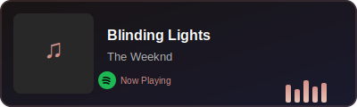

<div align="center">
  
</div>

<div align="center">
  
  # Hey there! 
  
  
  
  <br>
  
  
  
</div>

<div align="center">
  <br>
  <a href="https://www.abhaysinghrana.com/">
    
  </a>
  <a href="https://www.linkedin.com/in/abhay-singh-rana/">
    
  </a>
  <br><br>
</div>

---

## 🚀 About Me

I'm a **Product Designer** with **3+ years of experience** working on SaaS products, possessing advanced skills in **Research**, **Data Analysis**, and **Rapid Prototyping**. I specialize in transforming complex data into intuitive, user-friendly interfaces enhanced with AI capabilities.

### 💼 What I Do
- 🔍 **UX Research** & User-Centered Design
- 📊 **Data Analysis** to drive design decisions
- ⚡ **Rapid Prototyping** for quick iterations
- 🤖 **AI Integration** into product experiences
- 🎨 **Visual Design** for modern SaaS products

---

## 🛠️ Tech Stack & Tools

### Design & Prototyping


### Development & AI


---

## 📊 GitHub Stats

<div align="center">
  
  <!-- GitHub Stats Cards -->
  
  
  
</div>

<br>

<div align="center">
  
  ### 🎧 Vibing To
  
  <a href="https://open.spotify.com/track/4cOdK2wGLETKBW3PvgPWqT">
    
  </a>
  
</div>

<br>

<div align="center">
  
  <!-- Profile Views Counter -->
  
  
</div>

---

## 🔥 Popular Repositories

<div align="center">
  <a href="https://github.com/DRockoda/Social-distancing-detector">
    
  </a>
  <a href="https://github.com/DRockoda/Face-recognition">
    
  </a>
</div>

<div align="center">
  <a href="https://github.com/DRockoda/node-weather-website">
    
  </a>
  <a href="https://github.com/DRockoda/Movie-recommendator">
    
  </a>
</div>

---

## 🌟 Let's Connect

<div align="center">
  <a href="https://www.abhaysinghrana.com/" target="_blank">
    
  </a>
  <a href="https://drive.google.com/file/d/1a7AHYzkMW3xVwy5TqdK4_NrgwsIWwypr/view" target="_blank">
    
  </a>
  <a href="mailto:abhay_singh_rana@outlook.com" target="_blank">
    
  </a>
  <a href="https://www.linkedin.com/in/abhay-singh-rana/" target="_blank">
    
  </a>
  <a href="https://github.com/DRockoda" target="_blank">
    
  </a>
</div>

---

<div align="center">
  <br>
  
  
  
  <br><br>
  
  
  
  <br>
  
  ```diff
  + 🐺 Building something Magical!!!
  ```
  
  <br>
  
  
  
  
  <br><br>
  
  
  
</div>

